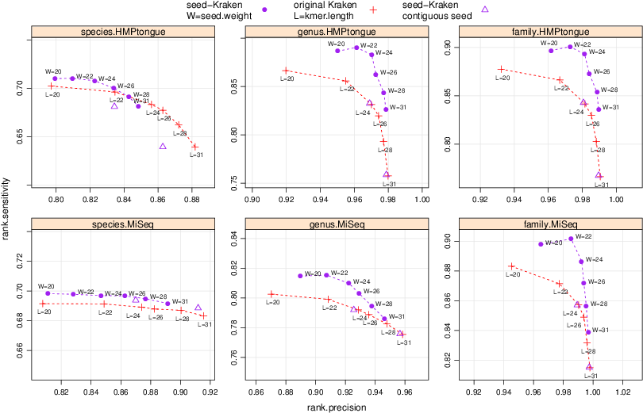

# Spaced seeds

A spaced seed is a local match triggering an alignment, encoded with a pattern of
matches interleaved with spaces – jokers (*“don’t care”* positions). 

Spaced is seed is characterized by its *weight* (number of matching characters) and its *span* (total length).
Below is an example of a *spaced seed* of weight 28 and span 40:
    
    SEED="######-##-#-#-##-###-#-##---###--#######"

In the *arXiv* paper [1] linked below, through a series
of computational experiments, we show that spaced seeds significantly improve the
accuracy of metagenomic classification of short NGS reads.

# Choosing a spaced seed

Choosing an optimal seed for a given task is a difficult problem.
[Iedera](http://bioinfo.lifl.fr/yass/iedera.php) provides a
versatile tool for designing good spaced seeds for various purposes.
Luckily, random seeds work well enough in most tasks.

In our experiments we've found that **seed-Kraken** with the use of the above weight 28 span 40 *spaced seed*
performs better on data with low error rate (plot below)
than **Kraken** with default setting of k-mer length 31,
and has higher sensitivity at the cost of slightly lower precision on other data.

Some optimized seeds with weights up to 24 can be found at
[http://www.lifl.fr/~noe/gk/](http://www.lifl.fr/~noe/gk/).
These seeds were selected according to a methodology described in [4].

# Improved sensitivity vs precision trade-off

Performance of classification of seed-Kraken (spaced seed modification),
and original Kraken, on metagenomes: 
<!--HiSeq (10 bacterial genomes, low error rate),-->
simulated MiSeq (10 bacterial genomes, average error rate, primarily described and used in [2]), 
and HMPtongue (50,000 sequences from SRS011086 Tongue dorsum metagenomic sample from Human Microbiome Project).
<!-- simBA-5 (607 bacterial genera, high error rate). -->
Charted are genus precision (positive predictive value) against
genus sensitivity (rate of correct assignments). Varying are k-mer length, and its spaced
seed equivalent seed weight, while the seed span varies from 31 to 40. 
seed-Kraken outperforms original Kraken in sensitivity/precision trade off, 
most evidently 
<!--on data with low error rate.-->
when classification is done at the level of genus, or family, taxonomic rank.

# Classification algorithm

Right now **seed-Kraken** employs an algorithm very similar to **Kraken**'s, 
different in the aspect of separately considering *sense/anti-sense* strands.

# Scientific publications

1. *Spaced seeds improve metagenomic classification.*  Karel Brinda, Maciej Sykulski, Gregory Kucherov [http://arxiv.org/abs/1502.06256](http://arxiv.org/abs/1502.06256)
<!--2. *Improved hit criteria for DNA local alignment* L. Noe and G. Kucherov.  BMC
Bioinformatics, 5(149), 14 October 2004.-->
2. [*Kraken: ultrafast metagenomic sequence classification using exact alignments.*](http://genomebiology.com/2014/15/3/R46) Wood DE, Salzberg SL: Genome Biology 2014, 15:R46.
3. [*Iedera: subset seed design tool*](http://bioinfo.lifl.fr/yass/iedera) G. Kucherov, L. Noé, and M. Roytberg, , 2009
4. [*A Coverage Criterion for Spaced Seeds and Its Applications to Support Vector Machine String Kernels and k-Mer Distances*](http://online.liebertpub.com/doi/abs/10.1089/cmb.2014.0173) L Noé, DEK Martin - Journal of Computational Biology, 2014
